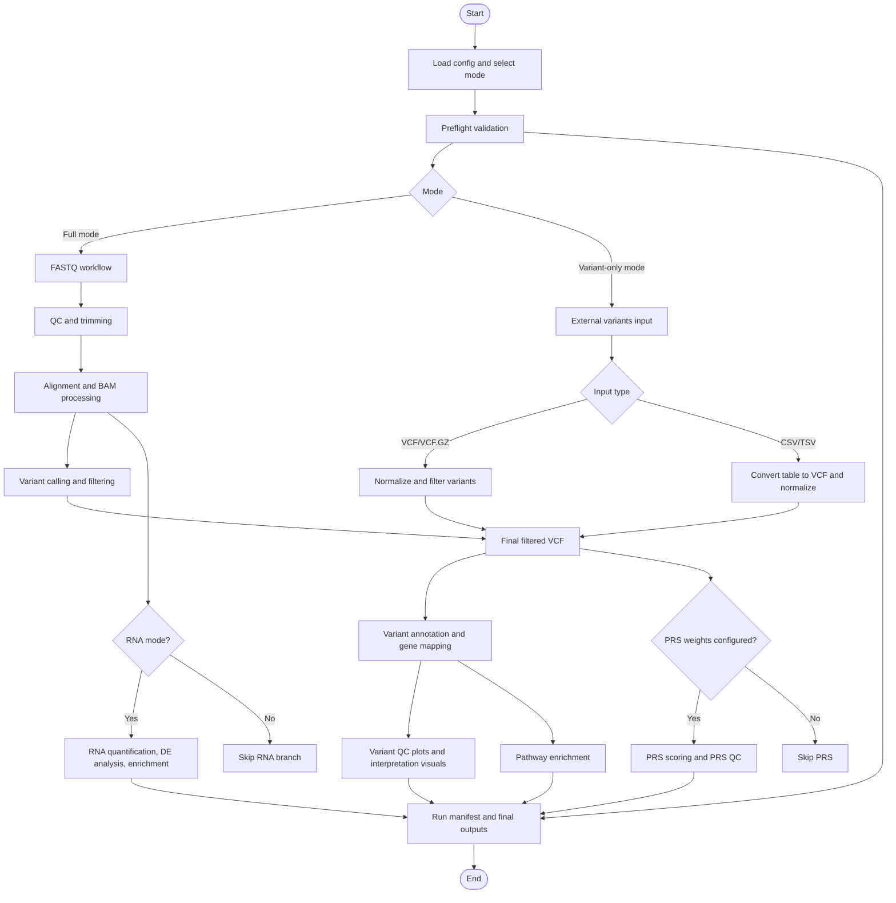

# Reproducible Bioinformatics Pipeline (DNA/RNA + PRS)

## Biological Significance

This pipeline is designed to connect **raw sequencing and external variant data to biologically interpretable outputs** that are commonly used in genomics and translational research:

- variant calling and functional annotation for DNA sequencing data
- GWAS summary interpretation (Manhattan/QQ/volcano plots)
- variant-to-gene mapping and pathway enrichment
- optional PRS scoring from genotype-bearing VCFs

In practice, this supports biologically meaningful workflows such as:

- prioritizing disease-associated loci (for example, AD GWAS signals in `APOE/TOMM40`)
- identifying pathways enriched in variant-mapped genes (for example, lipid/cholesterol transport pathways in Alzheimer-related GWAS summaries)
- comparing preprocessing quality changes before/after trimming in FASTQ pipelines
- harmonizing external cohort VCFs for downstream interpretation and PRS compatibility checks

This project provides a **fundamentals-first, reproducible Snakemake pipeline** that supports:

1. Pre-processing with FastQC
2. Quality control before/after filtering with summary plots
3. Filtering (read-level and variant-level)
4. Alignment to reference genome (GRCh38 recommended, hg19 supported)
5. Transcript and SNP identification + functional variant annotation
6. Differential gene expression (RNA mode)
7. Enrichment analysis (RNA mode + variant-gene mode)
8. PRS scoring

All outputs are written to `results/`, and detailed documentation is in `docs/`.

## Observed Final Validation Runs

The following are the current canonical real-dataset validation runs completed on Feb 27, 2026.

All three runs passed and replace older toy/example references in this repository.

| Mode | Example Input | Output Folder | Status |
| --- | --- | --- | --- |
| `variant_only` + `gwas_summary` | ADVP Alzheimer GWAS TSV (`advp.variant.records.hg38.tsv`) | `results_final_test_gwas_advp_20260227` | PASS |
| `variant_only` + `vcf_interpretation` | 1KG chr19 high-PRS-focused subset VCF | `results_final_test_ad_high_prs_20260227` | PASS |
| `full` (DNA short-read) | GIAB HG002 subset FASTQ | `results_final_test_full_giab_20260227` | PASS |

Additional runtime guidance for local/HPC/container setups is in `docs/REPRODUCIBLE_EXECUTION.md`.
Alzheimer PRS model details and calculation notes are in `docs/ALZHEIMERS_PRS.md`.
Alzheimer dataset files and caveats are in `docs/ALZHEIMERS_DATASETS.md`.
Statistical threshold rationale is documented in `docs/STATISTICAL_THRESHOLDS.md`.
Project architecture/thesis-style design rationale is in `docs/PROJECT_THESIS.md`.
GitHub publishing, branch protection, and citation setup is in `docs/GITHUB_PUBLISHING.md`.
Recent regression-test and example-file validation evidence is in `docs/validation/2026-02-23_regression_checks.md`.
Detailed canonical example interpretation is in `docs/REAL_DATASET_EXAMPLES.md`.
Final rerun metrics and pass/fail summary are in `FINAL_TEST.md`.

## Pipeline Architecture (High-Level)



Detailed split flowcharts (preflight/mode routing, full mode, and variant-only + interpretation + PRS) are documented in `docs/PIPELINE_DETAILS.md`.

## Quick Start

1. Prepare inputs using `docs/USER_INPUT_FORMATS.md`.
2. Update `config/config.yaml`.
3. Run:

```bash
snakemake --use-conda --cores 8
```

If you want a terminal loading spinner between rule logs:

```bash
./run_pipeline.sh --use-conda --cores 8
```

If Snakemake is not installed, create it from `envs/workflow.yaml` first.

For dry-run:

```bash
snakemake -n
```

For an explicit preflight validation-only check (resources, formats, build compatibility):

```bash
snakemake --use-conda --cores 1 --until preflight_resources
```

### Install and Run on a New PC (Verified)

1. Install prerequisites: `git`, Conda/Mamba (Miniforge/Mambaforge recommended), and a Unix-like shell (Linux/macOS; Windows users should use WSL2).
2. Clone the repository:

```bash
git clone https://github.com/vamsee2k1/PRS_GWAS_SNP_PIPELINE.git
cd PRS_GWAS_SNP_PIPELINE
```

3. Create and activate the workflow bootstrap environment (Snakemake + mamba):

```bash
conda env create -f envs/workflow.yaml
conda activate bioinfo-workflow
```

4. Add required local resources and inputs (these are not fully versioned in git):
- `resources/reference/GRCh38.fa`
- `resources/reference/Homo_sapiens.GRCh38.110.gtf`
- `resources/reference/star_grch38_index` (RNA short-read full mode)
- FASTQ inputs (full mode) or `paths.variants_input` VCF/CSV/TSV (variant-only mode)
- Optional PRS weights / gene sets if you enable those branches

Important: cloning this repository only downloads the pipeline code. Users must download reference genomes, annotations, GWAS/PRS files, and sample input data separately and place them on a local disk, external SSD, or mounted storage path that the pipeline can read.

Common public download sources (examples):
- Ensembl GRCh38 FASTA (release 110 primary assembly): `https://ftp.ensembl.org/pub/release-110/fasta/homo_sapiens/dna/Homo_sapiens.GRCh38.dna.primary_assembly.fa.gz`
- Ensembl GRCh38 GTF (release 110): `https://ftp.ensembl.org/pub/release-110/gtf/homo_sapiens/Homo_sapiens.GRCh38.110.gtf.gz`
- 1000 Genomes / IGSR VCFs (example public genotype VCFs): `https://ftp.1000genomes.ebi.ac.uk/vol1/ftp/release/20130502/`
- ClinVar GRCh38 VCFs (public clinical variants): `https://ftp.ncbi.nlm.nih.gov/pub/clinvar/vcf_GRCh38/`
- GWAS Catalog summary statistics: `https://www.ebi.ac.uk/gwas/downloads/summary-statistics`
- PGS Catalog score files (PRS weights): `https://www.pgscatalog.org/downloads/`
- MSigDB gene sets (registration/license may be required): `https://www.gsea-msigdb.org/gsea/msigdb`

Notes:
- The RNA `STAR` index is usually generated locally from your chosen FASTA + GTF (read-length dependent); this repository does not ship a prebuilt index.
- After downloading, update the YAML config paths (for example `reference.fasta`, `reference.gtf`, `reference.star_index`, `paths.variants_input`, `paths.prs_weights`, `paths.gene_sets`).

5. Run preflight validation first (recommended):

```bash
./run_pipeline.sh --use-conda --conda-frontend mamba --cores 1 --until preflight_resources
```

6. Run the pipeline (examples):

Full mode (default `config/config.yaml`):

```bash
./run_pipeline.sh --use-conda --conda-frontend mamba --cores 8 --rerun-incomplete --printshellcmds
```

Variant-only mode (VCF interpretation):

```bash
./run_pipeline.sh --use-conda --conda-frontend mamba --cores 8 --configfile config/final_tests/final_test_ad_high_prs.yaml
```

Variant-only mode (GWAS summary TSV/CSV):

```bash
./run_pipeline.sh --use-conda --conda-frontend mamba --cores 8 --configfile config/final_tests/final_test_gwas_advp.yaml
```

Full DNA mode (GIAB HG002 final test config):

```bash
./run_pipeline.sh --use-conda --conda-frontend mamba --cores 8 --configfile config/final_tests/final_test_full_giab.yaml
```

Mode-specific example configs (ready to copy and edit):

- `config/final_tests/final_test_gwas_advp.yaml`
- `config/final_tests/final_test_ad_high_prs.yaml`
- `config/final_tests/final_test_full_giab.yaml`

Variant-only mode (VCF/CSV/TSV to filtered variants + interpretation):

1. Set `run.mode: variant_only`
2. Set `run.variant_data_mode` to `vcf_interpretation` or `gwas_summary`
3. Set `paths.variants_input` to `.vcf`, `.vcf.gz`, `.csv`, or `.tsv`
4. Run `snakemake --use-conda --cores 8`

Direct shorthand modes are also supported:
- `run.mode: vcf_interpretation`
- `run.mode: gwas_summary`

Alzheimer PRS production config:

```bash
snakemake --use-conda --cores 8 --configfile config/config.alzheimers_prs.yaml
```

Real Alzheimer disease-annotated ClinVar variant run (no synthetic sample genotypes):

```bash
snakemake --use-conda --cores 8 --configfile config/config.alzheimers_clinvar.yaml
```

## Main Configuration

- `run.mode`: `full`, `variant_only`, `vcf_interpretation`, or `gwas_summary`
- `run.variant_data_mode`: `auto`, `vcf_interpretation`, `gwas_summary`
- `run.assay`: `dna` or `rna`
- `run.read_type`: `short` or `long`
- `run.enable_depth`: enable/disable depth outputs for quick tests vs production runs
- `reference.fasta`: reference genome FASTA
- `reference.gtf`: gene annotation GTF
- `reference.star_index`: required for RNA short-read mode
- `alignment.dna_short_aligner`: `auto`, `bwa_mem2`, `bwa`, `minimap2_sr`
- `depth.emit_all_positions`: use `samtools depth -a` (large output) vs covered positions only
- `paths.variants_input`: optional external `VCF/VCF.GZ/CSV/TSV`
- `paths.prs_weights`: PRS model file (PGS Catalog or simple TSV)
- `paths.gene_sets`: enrichment GMT file
- `annotation.method`: `overlap` or `snpeff`
- `annotation.snpeff_database`: required when `annotation.method=snpeff`
- `prs.weights_format`: `auto`, `pgs_catalog`, or `simple_tsv`
- `prs.allow_ambiguous_strand`: include/exclude ambiguous A/T and C/G SNPs
- `validation.enforce_build_match`: fail preflight when detected VCF build mismatches expected reference build
- `validation.fail_on_warning`: treat preflight warnings as hard failures
- `thresholds.min_variant_depth`: optional INFO/DP filter for variant records
- `thresholds.require_filter_pass`: require `FILTER=PASS` for external VCF filtering
- `thresholds.de_padj`: DE adjusted p-value cutoff (default `0.05`)
- `thresholds.de_abs_log2fc`: DE effect-size cutoff (default `1.0`)
- `thresholds.enrichment_qvalue`: enrichment q-value/FDR cutoff (default `0.05`)
- `thresholds.variant_assoc_pvalue`: variant association cutoff (default `5e-8`)
- `thresholds.variant_assoc_abs_effect`: variant association effect cutoff (default `0.0`)

## Reproducibility Features

- Workflow engine: Snakemake
- Isolated environments: per-step conda envs in `envs/`
- Deterministic output tree under `results/`
- Early preflight validation report: `results/docs/preflight_checks.tsv`
- Run metadata: `results/docs/run_manifest.txt`

## Output Structure

- `results/qc/`: FastQC + MultiQC + before/after QC summary
- `results/qc/alignment/`: per-sample alignment QC (`samtools flagstat`, `samtools stats`)
- `results/trimmed/`: filtered reads and fastp reports
- `results/alignment/`: sorted BAM and BAM index
- `results/depth/`: depth files, summary table, depth plot, mosdepth summaries
- `results/variants/`: called/filtered/final VCFs
- `results/variants/snpeff_summary.html`: optional `snpEff` consequence annotation report (`annotation.method=snpeff`)
- `results/variants/variant_qc_metrics.tsv`: SNP/indel counts, Ts/Tv, QUAL/DP/GQ summary metrics
- `results/variants/sample_missingness.tsv`: per-sample genotype missingness
- `results/variants/variant_type_counts.png`: variant class counts
- `results/variants/variant_qual_distribution.png`: QUAL histogram
- `results/variants/variant_dp_distribution.png`: DP histogram
- `results/variants/variant_gq_distribution.png`: GQ histogram
- `results/variants/variant_het_allele_balance.png`: heterozygous allele-balance (AD)
- `results/variants/variant_missingness_by_sample.png`: sample missingness plot
- `results/variants/annotated_variants.tsv`: per-variant functional class + mapped genes
- `results/variants/variant_genes.tsv`: genes hit by variants (for biology/enrichment)
- `results/variants/variant_association_hits.tsv`: significant variants by threshold
- `results/variants/variant_functional_classes.png`: functional-class distribution
- `results/variants/variant_chromosome_counts.png`: chromosome-level variant counts
- `results/variants/variant_volcano.png`: association volcano (or proxy prioritization from QUAL/AF/clinical-significance when GWAS p/effect are absent)
- `results/variants/variant_manhattan.png`: Manhattan plot (reported p-values or proxy ranking)
- `results/variants/variant_qq.png`: QQ plot for GWAS-style reported p-values
- `results/variants/variant_heatmap_top.png`: top-variant genotype/dosage heatmap; falls back to numeric variant-feature heatmap when sample genotype columns are unavailable
- `results/variants/variant_enrichment.tsv` + `variant_enrichment_dotplot.png`: pathway enrichment from variant-mapped genes
- `results/transcripts/`: StringTie transcripts + gene counts (RNA)
- `results/dge/`: DESeq2 result tables + volcano + heatmap (RNA)
- `results/enrichment/`: enrichment table + dotplot (RNA)
- `results/prs/`: PRS score output + PRS summary table + PRS QC + PRS distribution plot
- `results/docs/`: run manifest

## Example Results (From Real Test Runs)

These plots are from the current canonical real-dataset reruns:
- `results_final_test_gwas_advp_20260227`
- `results_final_test_ad_high_prs_20260227`
- `results_final_test_full_giab_20260227`

How these are plotted (pipeline implementation):
- variant QC and summary plots: `workflow/scripts/variant_qc_stats.py`
- association/interpretation plots (volcano/manhattan/qq/heatmap): `workflow/scripts/variant_visualization.py`
- enrichment dotplots: `workflow/scripts/variant_enrichment.R`
- PRS distribution + reports: `workflow/scripts/prs_from_vcf.py`, `workflow/scripts/prs_report.py`
- full-mode preprocessing QC comparison: `workflow/scripts/qc_compare.py`

### 1) GWAS Summary Mode (`ADVP` Alzheimer GWAS TSV, GRCh38)

Example run type:
- `variant_only` + `run.variant_data_mode: gwas_summary`
- Input: `advp.variant.records.hg38.tsv` (ADVP/NIAGADS-style GWAS summary table)
- Output: `results_final_test_gwas_advp_20260227`

Key biological signal observed in this test run:
- Strong association peak around chromosome 19 (`APOE` / `TOMM40` region), consistent with known Alzheimer disease GWAS signals.
- Enrichment highlights cholesterol/lipid transport and related pathways (e.g., `NR1H3/NR1H2`, `ABC transporters`), which is biologically plausible in AD genetics.

Example top hits seen in generated `variant_association_hits.tsv`:
- `rs2075650` (`TOMM40`)
- `rs769449` (`APOE`)


Caveat:
- ADVP is a summary-statistics dataset, not a sample genotype VCF, so it supports GWAS interpretation and enrichment but not individual-level PRS scoring.

### 2) Variant-Only Mode (AD high-PRS-focused VCF example)

Example run type:
- `variant_only` + `run.variant_data_mode: vcf_interpretation`
- Input: `data/variants/alzheimers/final_tests/1kg_chr19_high_prs_top40.vcf.gz`
- Output: `results_final_test_ad_high_prs_20260227`

What this demonstrates:
- External VCF normalization/filtering
- Variant class/QC summaries from genotype-bearing VCF input
- Gene/pathway enrichment from mapped variant genes
- PRS harmonization branch behavior

Interpretation notes from this test:
- This run is useful for AD PRS workflow demonstration because the sample set is enriched for previously high-scoring individuals.
- PRS model locus coverage is still limited (`matched_model_variants = 3` of 83 in `prs_qc.tsv`), so absolute biological interpretation should remain cautious.


### 3) Full Mode (GIAB HG002 short-read DNA final test run)

Example run type:
- `full` mode with DNA short-read input
- GIAB benchmark sample subset (`HG002`)
- Example output directory: `results_final_test_full_giab_20260227`

What this demonstrates:
- End-to-end FASTQ processing (QC -> trimming -> alignment -> duplicate marking -> variant calling/filtering)
- Variant QC metrics and visualization from a real benchmark sample
- Depth summary generation using `mosdepth` summaries + optional per-base depth TSV
- Variant-to-gene mapping and enrichment output generation in `full` mode

Observed test-run QC outcome:
- Read retention after filtering: `94.167%`
- Bases retention after filtering: `93.927%`
- Q30 fraction improved from `0.905889` to `0.933511`

Observed test-run variant QC outcome:
- `total_variants = 13520`
- `snp_count = 12556`
- `indel_count = 905`
- `multiallelic_count = 59`
- `ts/tv = 1.53657`

Observed depth summary (same run):
- `mean_depth = 0.089x`
- `pct_cov_ge_1x = 8.0%`
- `pct_cov_ge_10x = 0.0%`
- Depth summary source: `mosdepth`

Biological importance (and limits) of this full-mode example:
- `HG002` is a widely used Genome in a Bottle benchmark sample, so this run is biologically useful for **technical validation** of variant-calling and QC behavior across the full pipeline.
- The run confirms the pipeline preserves expected processing signals (improved post-trim read quality, plausible SNV/indel composition, usable annotation/enrichment outputs) on real sequencing-derived data.
- Because this is a **practical-depth subset / benchmark-style test**, the enrichment output should be interpreted as a demonstration of the annotation + pathway workflow, not as disease-specific biological discovery.


## Notes

- **GRCh38 is recommended** as the current standard reference.
- Use hg19/GRCh37 only when you must match legacy cohorts.
- Differential expression and enrichment are RNA-focused analyses.
- Default PRS model is Alzheimer disease PGS Catalog score `PGS002280` (GRCh38).
- If no Alzheimer model loci are matched in the VCF, PRS output reports score `0` with an explicit non-interpretable coverage note.
- This repository is open source (Apache-2.0). If used in research/benchmarking/publications, cite the repository release and report the exact version/config/reference resources used (see `CITATION.cff`).
