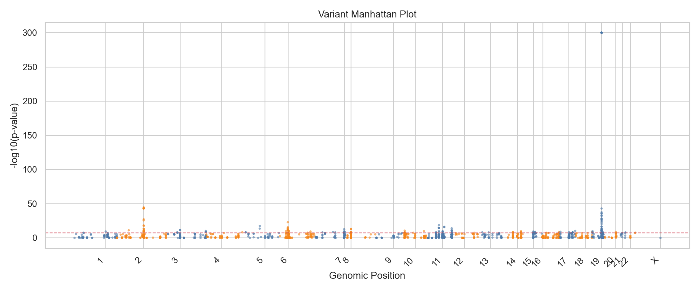
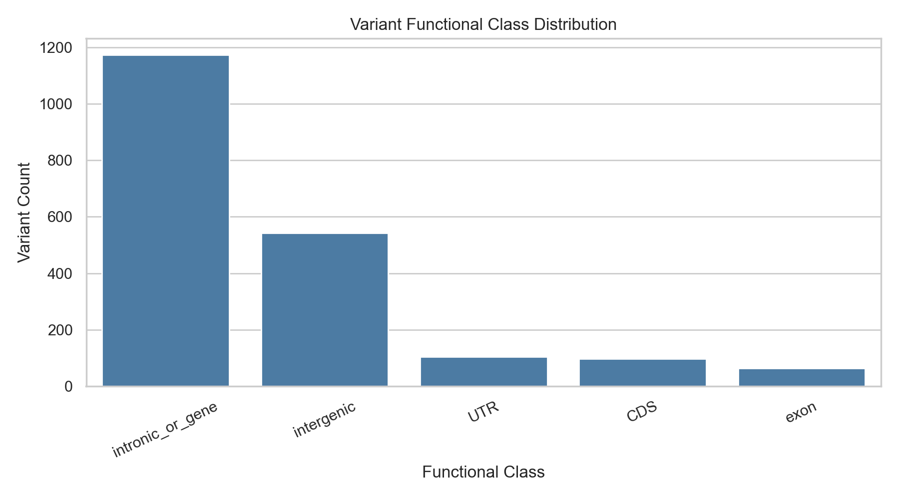
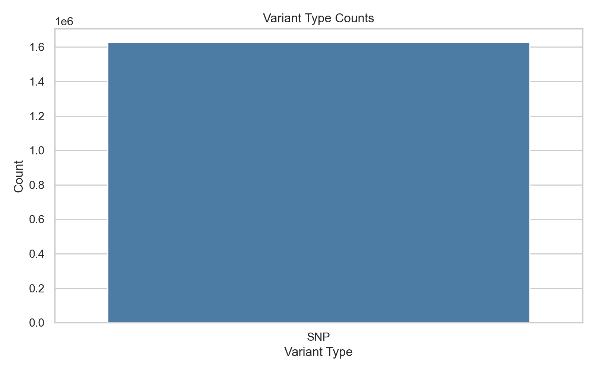
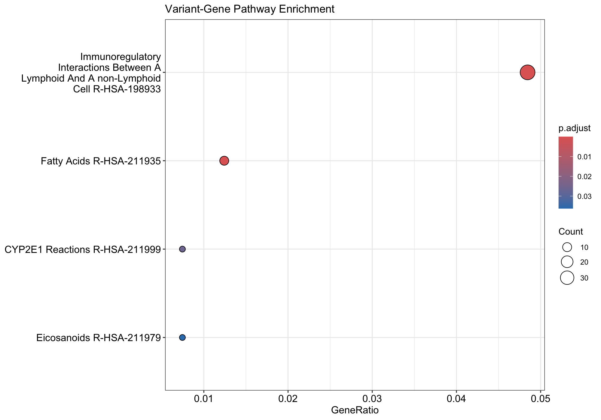
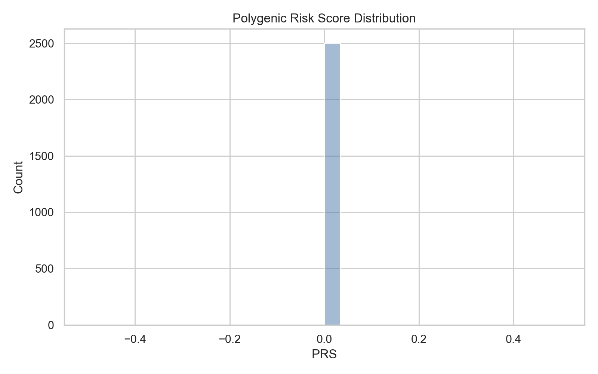
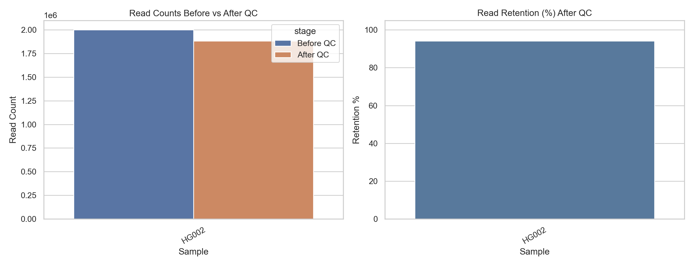
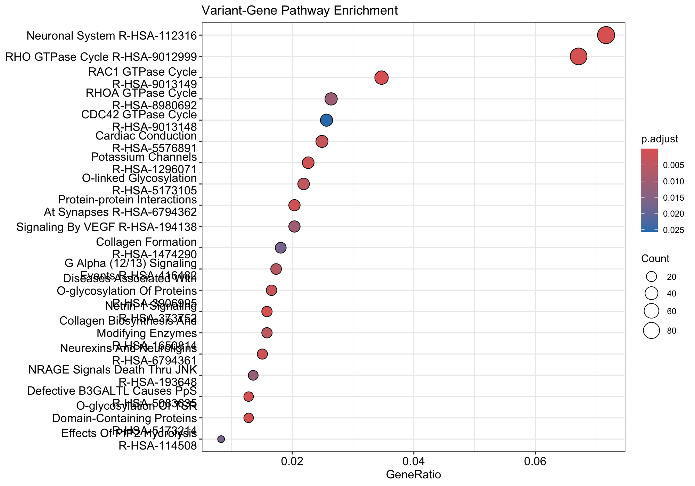

# Reproducible Bioinformatics Pipeline (DNA/RNA + PRS + AI)

## 1) Problem and Market Gap

Many genomics users can run individual tools, but still struggle with:

- fragmented workflows across QC, alignment, variant calling, annotation, enrichment, and PRS
- inconsistent reproducibility across systems and reruns
- unclear handoff from technical outputs to biological interpretation
- difficult onboarding for new users who need a clone-to-results path

This pipeline addresses that gap with one reproducible Snakemake workflow that supports:

- full FASTQ-to-interpretation processing
- external VCF/CSV/TSV interpretation mode
- GWAS summary interpretation mode
- optional AI-assisted result explanation and triage outputs

## 2) Biological Significance

The workflow is designed to convert raw sequencing or external variant data into biologically meaningful outputs used in translational genomics:

- disease-associated variant prioritization (for example AD-associated loci)
- variant-to-gene mapping and pathway enrichment
- quality-aware interpretation using QC metrics and association plots
- optional PRS harmonization/scoring from genotype-bearing VCFs

This helps users move from data processing to biological interpretation with traceable, reproducible outputs.

## 3) Pipeline Flowchart


Detailed split flowcharts are in `docs/PIPELINE_DETAILS.md`.

## 4) How to Run This Pipeline (Clone -> Results)

### 4.1 Clone and Environment Setup

```bash
git clone https://github.com/vamsee2k1/PRS_GWAS_SNP_PIPELINE.git
cd PRS_GWAS_SNP_PIPELINE
conda env create -f envs/workflow.yaml
conda activate bioinfo-workflow
```

### 4.2 Required Inputs and Resources

Minimum resources for DNA/variant workflows:

- reference FASTA: `<reference_fasta>`
- reference GTF: `<reference_gtf>`
- pathway gene sets GMT: `<gene_sets_gmt>`

Optional resources:

- PRS weights: `<prs_weights_file>`
- RNA short-read STAR index: `<star_index_dir>`

Important:

- Users do not convert FASTQ/VCF/TSV into YAML.
- YAML files only store configuration and paths.
- Resources can be in `resources/` or any absolute path you provide in YAML.

### 4.3 YAML Path Templates (Generic)

Variant-only VCF mode (`config/my_variant_vcf.yaml`):

```yaml
run:
  mode: variant_only
  variant_data_mode: vcf_interpretation
  assay: dna
  read_type: short

reference:
  fasta: <reference_fasta>
  gtf: <reference_gtf>

paths:
  variants_input: <input_vcf_or_vcfgz>
  prs_weights: <prs_weights_file_or_empty>
  gene_sets: <gene_sets_gmt>
```

Variant-only GWAS mode (`config/my_variant_gwas.yaml`):

```yaml
run:
  mode: variant_only
  variant_data_mode: gwas_summary
  assay: dna
  read_type: short

reference:
  fasta: <reference_fasta>
  gtf: <reference_gtf>

paths:
  variants_input: <input_tsv_or_csv>
  prs_weights: ""
  gene_sets: <gene_sets_gmt>
```

Full mode (`config/my_full_mode.yaml`):

```yaml
run:
  mode: full
  assay: dna
  read_type: short

reference:
  fasta: <reference_fasta>
  gtf: <reference_gtf>

samplesheet: <samples_tsv>
metadata: <metadata_tsv>

paths:
  gene_sets: <gene_sets_gmt>
  prs_weights: <prs_weights_file_or_empty>
```

Sample sheet example (`<samples_tsv>`):

```tsv
sample	fastq_1	fastq_2
S1	<input_fastq_r1>	<input_fastq_r2>
```

Metadata example (`<metadata_tsv>`):

```tsv
sample
S1
```

AI settings (optional, in any config):

```yaml
ai:
  enabled: true
  explainer: true
  qc_anomaly: true
  variant_prioritization: true
  top_n: 50
  trait_context: "Your trait context"
  priority_genes: [GENE1, GENE2, GENE3]
```

### 4.4 Run Commands for the 3 Main Modes (Generic)

```bash
# 1) Variant-only VCF mode
./run_pipeline.sh --use-conda --cores 8 \
  --configfile config/my_variant_vcf.yaml \
  --config output_dir=results_variant_vcf
```

```bash
# 2) Variant-only GWAS TSV/CSV mode
./run_pipeline.sh --use-conda --cores 8 \
  --configfile config/my_variant_gwas.yaml \
  --config output_dir=results_variant_gwas
```

```bash
# 3) Full mode (FASTQ input)
./run_pipeline.sh --use-conda --cores 8 \
  --configfile config/my_full_mode.yaml \
  --config output_dir=results_full_mode
```

Useful run options:

```bash
# Dry-run only
./run_pipeline.sh -n --use-conda --cores 8 --configfile config/my_variant_gwas.yaml

# Preflight only
./run_pipeline.sh --use-conda --cores 1 --until preflight_resources --configfile config/my_variant_gwas.yaml

# Full verbose terminal output (default is clean progress mode)
PIPELINE_VERBOSE=1 ./run_pipeline.sh --use-conda --cores 8 --configfile config/my_variant_gwas.yaml
```

### 4.5 Optional: Quick Tests with Bundled `test_data`

```bash
# GWAS summary test
./run_pipeline.sh --use-conda --cores 8 --configfile config/test_data/test_niagads_advp_ad_gwas_hg38.yaml

# VCF interpretation test
./run_pipeline.sh --use-conda --cores 8 --configfile config/test_data/test_giab_nist7035_vcf_subset_grch38.yaml

# Full mode test
./run_pipeline.sh --use-conda --cores 8 --configfile config/test_data/test_giab_nist7035_fastq_subset_grch38.yaml
```

YAML code for all bundled tests is documented in:
- `test_data/README.md`

## 5) Bundled Test Data Table (Current)

| Mode | Test Data Files | Config File | Purpose |
| --- | --- | --- | --- |
| `variant_only` + `gwas_summary` | `test_data/niagads_advp_ad_gwas_hg38/niagads_advp_ad_variant_records_hg38.tsv` | `config/test_data/test_niagads_advp_ad_gwas_hg38.yaml` | Validate TSV/CSV -> VCF conversion, GWAS interpretation, enrichment, AI reports |
| `variant_only` + `vcf_interpretation` | `test_data/giab_nist7035_vcf_subset_grch38/giab_nist7035_subset_grch38.vcf.gz` (+ `.tbi`) | `config/test_data/test_giab_nist7035_vcf_subset_grch38.yaml` | Validate external VCF normalization/filtering, annotation, PRS branch, AI reports |
| `full` (DNA short-read) | `test_data/giab_nist7035_fastq_subset_grch38/giab_nist7035_subset_R1.fastq.gz`, `test_data/giab_nist7035_fastq_subset_grch38/giab_nist7035_subset_R2.fastq.gz` | `config/test_data/test_giab_nist7035_fastq_subset_grch38.yaml` | Validate full FASTQ workflow (QC->alignment->variants->annotation->AI) |

## 6) Real-Run Examples, Plots, and Biological Interpretation

### 6.1 Canonical Validation Runs (Real Datasets)

| Mode | Example Input (Final) | Output Folder (Final) | Runtime (Feb 27, 2026) | Historical Runtime (Feb 24, 2026) | Quality Snapshot (Final) | Status |
| --- | --- | --- | --- | --- | --- | --- |
| `variant_only` + `gwas_summary` | ADVP Alzheimer GWAS TSV (`advp.variant.records.hg38.tsv`) | `results_final_test_gwas_advp_20260227` | `21 sec` | `22 sec` (`results_advp_gwas_20260224_retest`) | `1,981` variants, `Ts/Tv=2.221`, AD hits in `APOE/TOMM40` region | PASS |
| `variant_only` + `vcf_interpretation` | 1KG chr19 high-PRS-focused subset VCF | `results_final_test_ad_high_prs_20260227` | `1 min 9 sec` | `8 min 58 sec` (`results_alzheimers_prs_1kg_chr19_20260224_retest`) | `1,625,698` variants, `Ts/Tv=2.351`, PRS matched loci `3/83` | PASS |
| `full` (DNA short-read) | GIAB HG002 subset FASTQ | `results_final_test_full_giab_20260227` | `6 min 24 sec` | `37 min 10 sec` (`results_giab_hg002_full_20260224_practical_depth_hg002`) | read retention `94.17%`, `13,520` variants, `Ts/Tv=1.537` | PASS |

How plots are generated:

- variant QC: `workflow/scripts/variant_qc_stats.py`
- association plots: `workflow/scripts/variant_visualization.py`
- enrichment dotplot: `workflow/scripts/variant_enrichment.R`
- PRS outputs: `workflow/scripts/prs_from_vcf.py`, `workflow/scripts/prs_report.py`
- full-mode QC summary: `workflow/scripts/qc_compare.py`

### 6.2 GWAS Summary Example (ADVP TSV)

Biological interpretation:

- major AD-associated signal appears in chr19 (`APOE/TOMM40` region)
- enrichment includes lipid/cholesterol transport pathways relevant to AD
- supports GWAS summary interpretation, not individual-level PRS





### 6.3 Variant-Only VCF Example (High-PRS-focused)

Biological interpretation:

- demonstrates variant interpretation and PRS branch behavior on genotype-bearing VCF
- PRS coverage is limited (`3/83` matched loci), so absolute risk interpretation should be cautious





### 6.4 Full FASTQ Example (GIAB HG002)

Biological/technical interpretation:

- confirms end-to-end processing on real benchmark sequencing data
- observed QC improvement post-filtering and plausible SNV/indel composition
- enrichment here is a workflow demonstration, not disease-specific discovery





## 7) Notes, References, License, Citation

Notes:

- GRCh38 is recommended.
- Use hg19/GRCh37 only when matching legacy cohorts.
- AI outputs are additive; core scientific tables remain unchanged.
- Full run details are always written to `.snakemake/log/...`.

Documentation index:

- `docs/PIPELINE_DETAILS.md`
- `docs/USER_INPUT_FORMATS.md`
- `docs/AI_INTEGRATION.md`
- `docs/REPRODUCIBLE_EXECUTION.md`
- `docs/REAL_DATASET_EXAMPLES.md`
- `FINAL_TEST.md`
- `test_data/README.md` (bundled test YAMLs + dataset references)

Public dataset references used by bundled `test_data`:

- NIAGADS ADVP: https://advp.niagads.org/
- GIAB data portal (NIST-backed reference samples): https://ftp-trace.ncbi.nlm.nih.gov/ReferenceSamples/giab/
- PGS Catalog score used in the VCF test config (`PGS002280`): https://www.pgscatalog.org/score/PGS002280/

License:

- Apache-2.0 (`LICENSE`)

Citation:

- Use `CITATION.cff` for citation metadata.
- For publications, report repository commit/tag, config YAML, reference build, and key resource versions.
