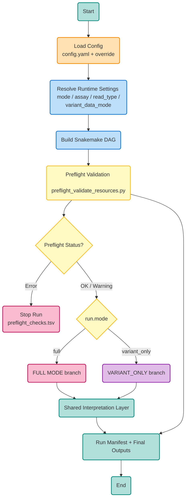
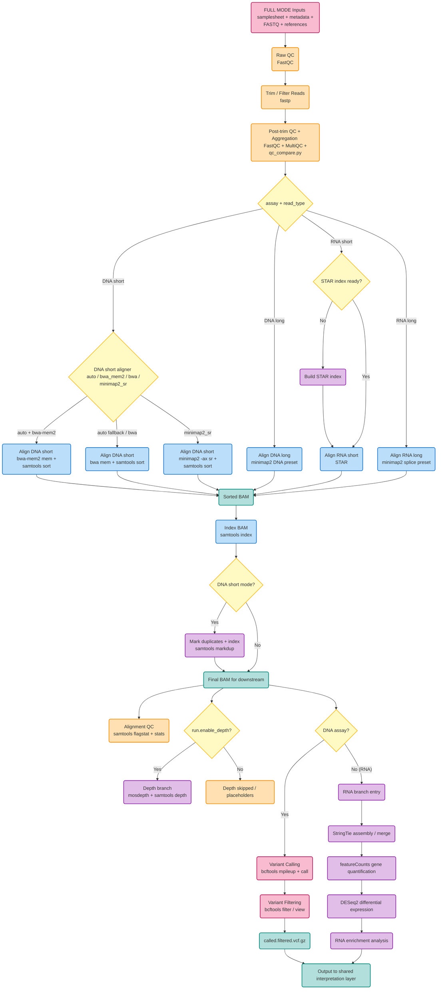
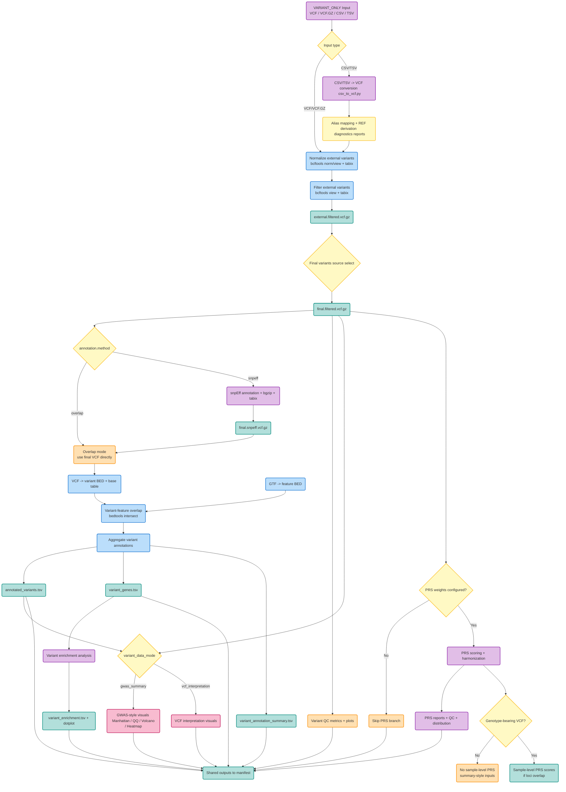

# Pipeline Details (Step-by-Step)

## Pipeline Flowcharts

### 1) Preflight + Mode Routing

### 2) Full Mode (FASTQ to Variant Calling / RNA Branch)

### 3) Variant-Only + Shared Interpretation + PRS

## Step 1: Pre-processing (`FastQC`)

- Runs FastQC on raw reads.
- Outputs per-sample HTML/ZIP reports in `results/qc/raw/`.

## Step 2: Quality Control Before/After + Read Depth

- `fastp` performs filtering/trimming.
- FastQC reruns on trimmed reads.
- `workflow/scripts/qc_compare.py` summarizes before/after read retention.
- `samtools depth` computes per-position depth.
- `workflow/scripts/depth_summary.py` creates depth summary and distribution plots.
- `samtools flagstat` and `samtools stats` create per-sample alignment QC summaries.
- `mosdepth` creates per-sample coverage summaries.

Outputs:
- `results/qc/qc_before_after.tsv`
- `results/qc/qc_before_after.png`
- `results/depth/depth_summary.tsv`
- `results/depth/depth_distribution.png`

## Step 3: Filtering

- Read-level filtering by fastp (quality + length thresholds).
- Variant-level filtering by bcftools (`FILTER=PASS`, `QUAL`, optional `INFO/DP` threshold).

## Step 4: Alignment to Reference Genome

- DNA short reads: `bwa-mem2`
- DNA long reads: `minimap2`
- RNA short reads: `STAR`
- RNA long reads: `minimap2` splice mode

Outputs:
- `results/alignment/*.sorted.bam`
- `results/alignment/*.sorted.bam.bai`

## Step 5: Transcript + SNP Identification + Functional Variant Annotation

RNA branch:
- Transcript assembly: `StringTie`
- Merged transcript model: `stringtie --merge`
- Gene-level quantification: `featureCounts`

Variant branch:
- Variant calling: `bcftools mpileup + call`
- Short-read DNA mode marks duplicates with `samtools markdup` before calling.
- Variant filtering: `bcftools filter`
- Biological variant QC summary: SNP/indel counts, Ts/Tv, QUAL/DP/GQ distributions, allele balance, per-sample missingness
- Functional annotation: genomic feature overlap against GTF (`CDS`, `UTR`, `exon`, `intronic_or_gene`, `intergenic`)
- Functional annotation merges overlap-based mapping with reported VCF gene tags when available (`GENEINFO`, `GENE`, etc.)
- Optional primary consequence annotation via `snpEff` is supported (`annotation.method=snpeff`).
- Gene mapping table for downstream biology interpretation
- Variant plots: feature distribution, chromosome counts, volcano, Manhattan, genotype heatmap
  - Sample VCF QC family: SNP/indel counts, Ts/Tv, QUAL/DP/GQ distributions, allele balance, per-sample missingness
  - GWAS family: Manhattan/volcano/QQ when reported association p-values are available
  - If p-value/effect are missing, volcano/Manhattan use proxy prioritization (QUAL/AF and ClinVar-style clinical significance where available).
  - GWAS mode additionally generates a QQ plot (reported p-values only).
  - If genotype columns are absent, heatmap falls back to a variant-feature heatmap.

Outputs:
- `results/transcripts/`
- `results/variants/`

## Step 6: Differential Gene Expression

- `DESeq2` on gene count matrix.
- Produces full results table, normalized counts, volcano plot, top-gene heatmap.

Outputs:
- `results/dge/deseq2_results.tsv`
- `results/dge/normalized_counts.tsv`
- `results/dge/volcano.png`
- `results/dge/heatmap_top50.png`

## Step 7: Enrichment Analysis

- `clusterProfiler::enricher` using provided GMT pathways.
- Generates enrichment table and dotplot.

Outputs:
- `results/enrichment/enrichment_results.tsv`
- `results/enrichment/enrichment_dotplot.png`
- `results/variants/variant_enrichment.tsv`
- `results/variants/variant_enrichment_dotplot.png`

## Step 8: PRS Scoring

- `workflow/scripts/prs_from_vcf.py` computes per-sample PRS from filtered VCF + PRS model file.
- Supports official PGS Catalog scoring files and simple TSV weights.
- Includes allele harmonization and optional dosage (`DS`) parsing.
- PRS QC includes build-compatibility checks, rsID/position match counts, strand flips, and skipped ambiguous SNP counts.
- `workflow/scripts/prs_report.py` produces table + distribution plot.

Outputs:
- `results/prs/plink.sscore`
- `results/prs/prs_scores.tsv`
- `results/prs/prs_qc.tsv`
- `results/prs/prs_distribution.png`

## Destination and Documentation

- Result destination folder: `results/`
- Detailed pipeline documentation: `docs/`
- Run-specific manifest: `results/docs/run_manifest.txt`

## Default Statistical Thresholds

- Differential expression significance: `padj < 0.05` and `|log2FC| >= 1.0`
- Enrichment significance: `q-value (BH-adjusted p) < 0.05`
- Variant association plots/tables: `p-value <= 5e-8` (genome-wide significance), configurable in `config.yaml`
